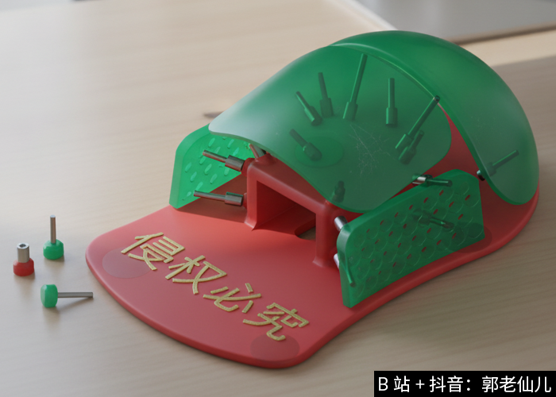
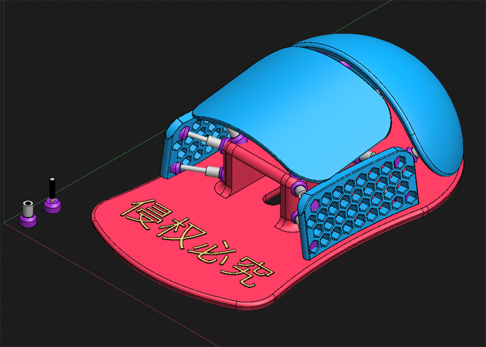
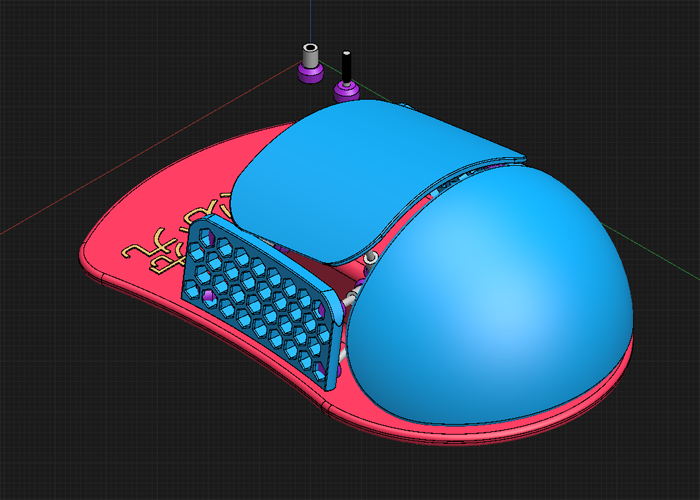
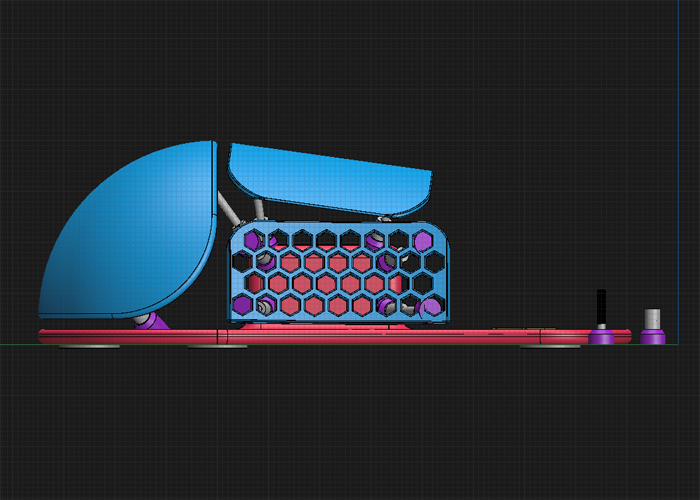
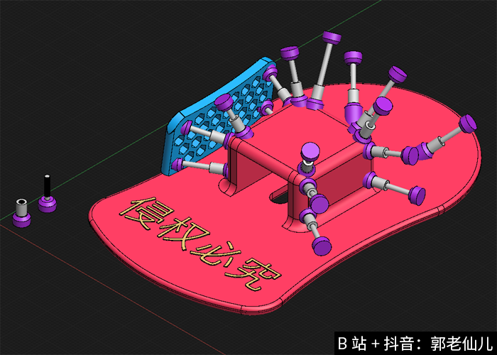
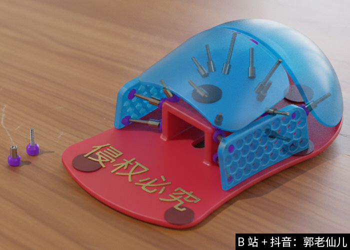
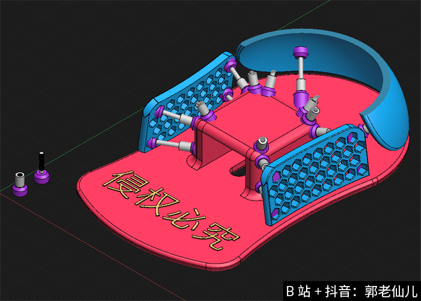
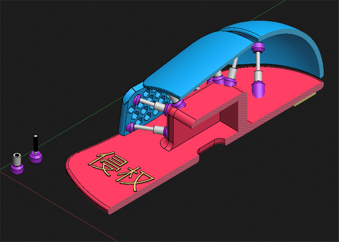
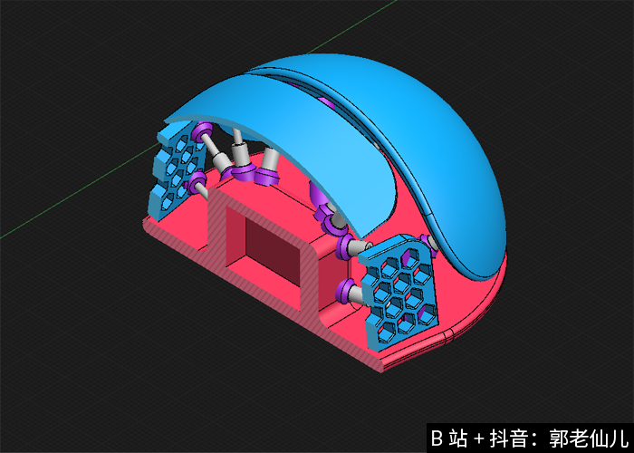
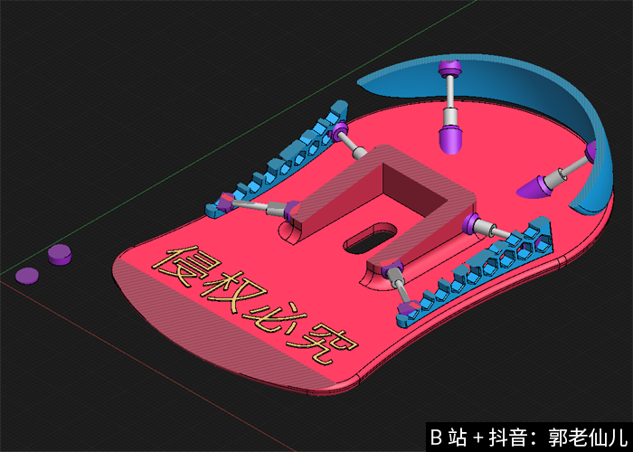

### 💡 三轴可调节、六自由度人体工程学鼠标支撑平台 （海胆平台）

**[防御性公开声明 / Defensive Publication]**

本平台设计仅授权个人以非商业目的进行学习、研究及个人3D打印实践。

不得用于任何商业用途，包括但不限于生产制造、销售、代工、广告宣传、商业展示及其他营利性质活动。

未经发明人书面授权，不得修改后公开发布或用于任何商业营利性质用途。任何侵权行为将依法追究法律责任。

---

## 📸 主视觉展示 (Main Overview)

---

## 🖼️ 系统结构总览 (Visual Overview)

| | | |
| :---: | :---: | :---: |
|  |  |  |
|  |  |  |
|  |  |  |

---

## 📜 许可协议 (License)

本项目采用 **[CC BY-NC-ND 4.0](https://creativecommons.org/licenses/by-nc-nd/4.0/deed.zh-hans)** 协议进行授权。

您可以自由地：

共享 — 在任何媒介以任何形式复制、发行本作品

只要你遵守许可协议条款，许可人就无法收回你的这些权利。

惟须遵守下列条件：

署名 — 您必须给出适当的署名，提供指向本许可协议的链接，同时标明是否（对原始作品）作了修改。您可以用任何合理的方式来署名，但是不得以任何方式暗示许可人为您或您的使用背书。

非商业性使用 — 您不得将本作品用于商业目的。

禁止演绎 — 如果您再混合、转换、或者基于该作品创作，您不可以分发修改作品。

*   **署名 (BY)**：必须给出适当的署名。
*   **非商业性使用 (NC)**：不得将本设计用于任何商业目的。
*   **禁止演绎 (ND)**：不得对本设计进行修改、变动或再创作。
